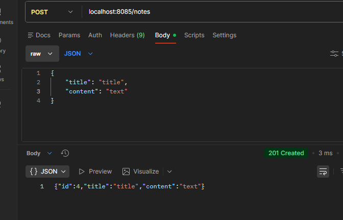
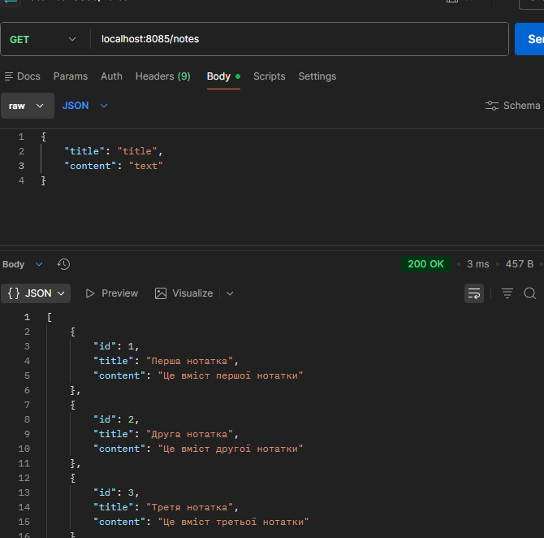
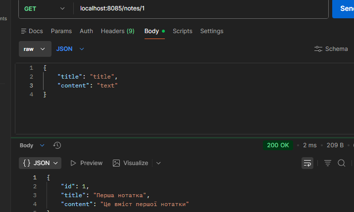
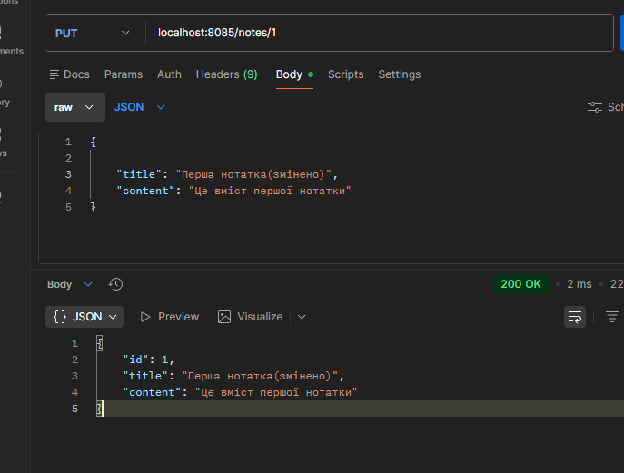
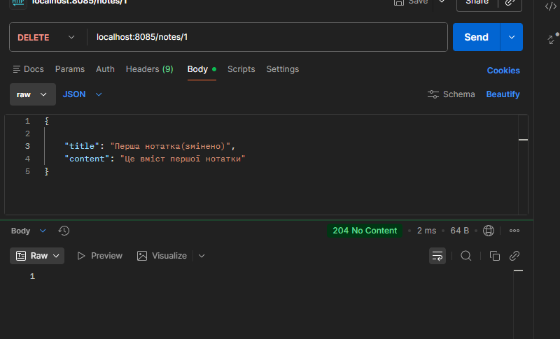
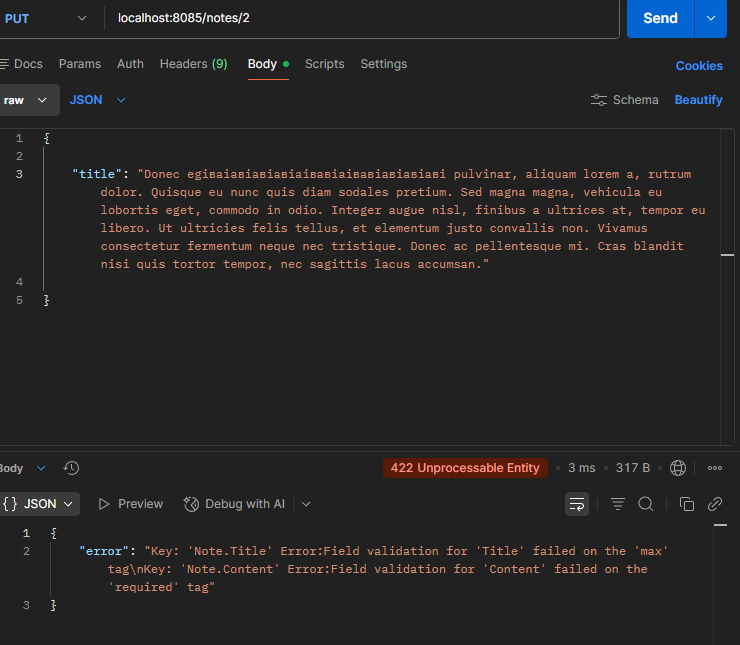

# Лабораторна робота №7 — REST API на Go (Fiber + easyjson)

## Опис

REST API для управління нотатками. Сервер запускається на порту `8085`.

## Ендпоінти

| Метод    | URL              | Опис                        |
|----------|------------------|-----------------------------|
| `GET`    | `/notes`         | Отримати всі нотатки        |
| `GET`    | `/notes/:id`     | Отримати нотатку за ID      |
| `POST`   | `/notes`         | Створити нову нотатку       |
| `PUT`    | `/notes/:id`     | Оновити нотатку за ID       |
| `DELETE` | `/notes/:id`     | Видалити нотатку за ID      |

## Скріншоти

### POST /notes — створення нотатки (201 Created)

### GET /notes — отримання всіх нотаток (200 OK)

### GET /notes/1 — отримання нотатки за ID (200 OK)

### PUT /notes/1 — оновлення нотатки (200 OK)

### DELETE /notes/1 — видалення нотатки (204 No Content)

### PUT /notes/2 — валідація (422 Unprocessable Entity)

